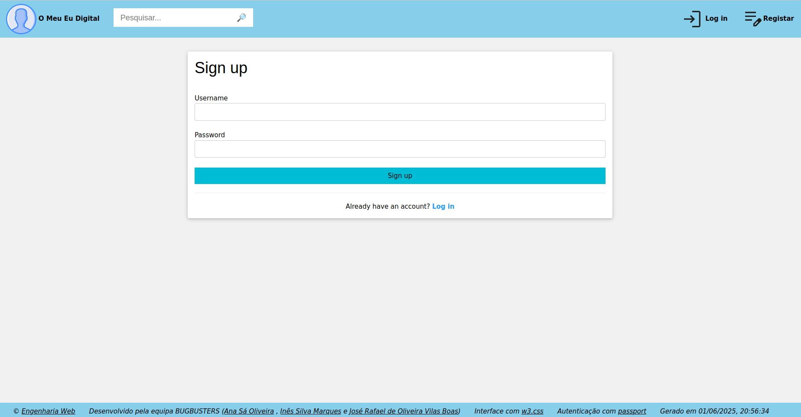
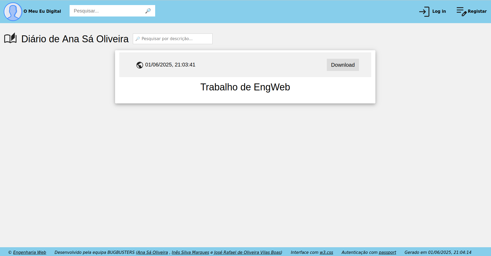
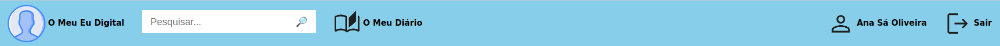
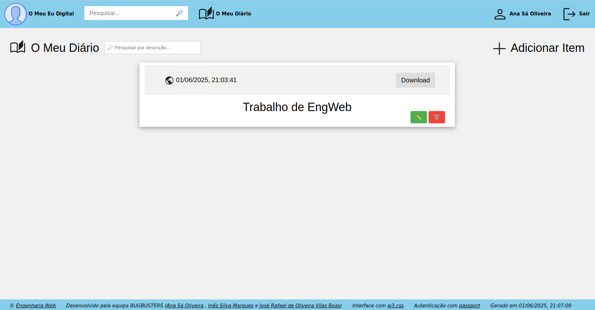
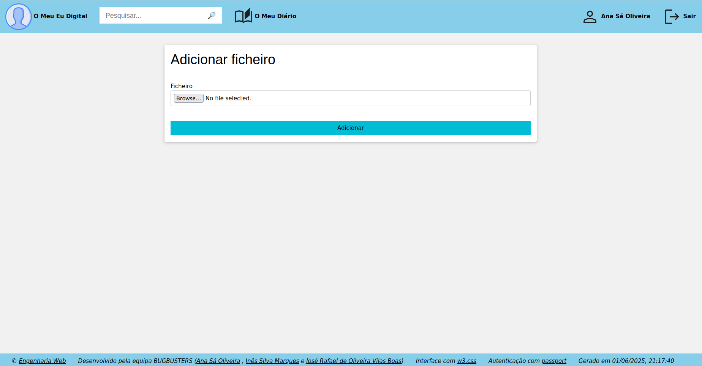
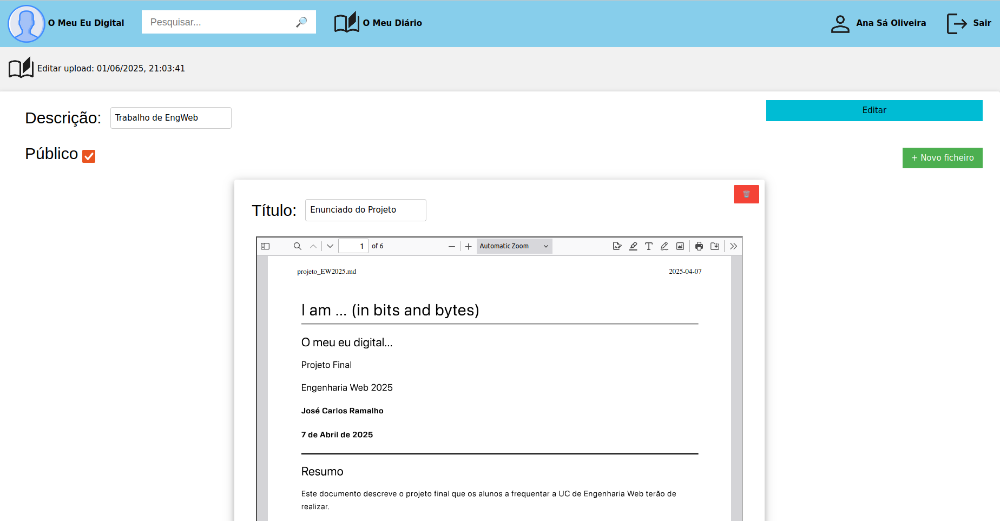
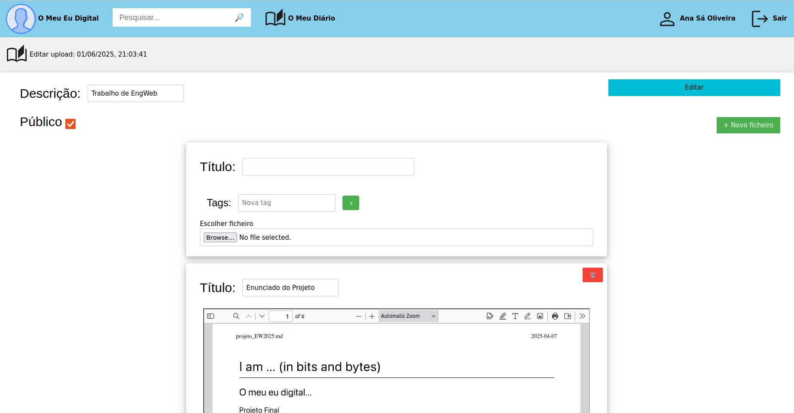
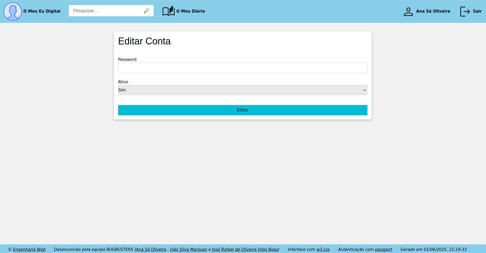
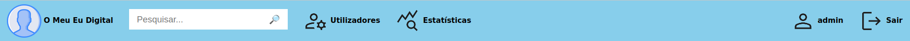

# Projeto EW - I am ... (in bits and bytes) - O meu eu digital - Relatório
## Descrição
Este repositório foi criado para a Unidade Curricular de **Engenharia Web** (**EW**) e contém o projeto que desenvolvemos ao longo do segundo semestre do ano letivo de 2024/2025, no âmbito desta disciplina.

O projeto consistirá no desenvolvimento de uma aplicação Web, constituída por um frontend (interface
pública), backend (interface de administração e privada), persistência de dados em base de dados,
ficheiros e outros e lógica de controlo em JavaScript.

A aplicação irá suportar o "eu digital" do utilizador, ou seja, será uma espécie de diário digital. Diário digital
quer dizer que as operações sobre os dados têm uma cronologia associada e que a linha temporal será o
eixo principal da aplicação. Em termos de conteúdos, pretende-se o máximo de possibilidades como por
exemplo: fotografias, registos desportivos, crónicas, pensamentos soltos, resultados académicos,
participação em eventos, organização de eventos, opiniões, comentários sobre outros recursos Web, etc.

Para mais detalhes sobre os requisitos e objetivos do projeto, consulte o [enunciado](Enunciado.pdf).

O código desenvolvido pode ser encontrado na pasta [src](src).

Imagens usadas neste relatório podem ser encontradas na pasta [images](images).

Um exemplo de SIP para testar o upload de uma publicação: [SIP.zip](SIP.zip).

## Autores
### Equipa Bugbusters 🪲🚫 - Grupo 12
- A104437 - Ana Sá Oliveira
- A104263 - Inês Silva Marques
- A76350 - José Rafael de Oliveira Vilas Boas


# O Meu Eu Digital

O Meu Eu Digital é uma aplicação que permite aos seus utilizadores guardarem e expressarem os seus pensamentos e momentos, um diário digital em que cada utilizador possui um espaço pessoal onde pode registar imagens, pdfs e texto.

## Arquitetura

Para implementar esta aplicação, implementamos 3 serviços:
- **Autenticação** (pasta [src/Auth](src/Auth) e porta 3002) - responsável por gerenciar a autenticação e autorização dos utilizadores.
- **API de dados** (pasta [src/API_de_dados](src/API_de_dados) e porta 3001) - responsável por fornecer os dados da aplicação.
- **Interface** (pasta [src/Interface](src/Interface) e porta 3000) - responsável pelo front-end da aplicação.

A nossa aplicação utiliza:
- Uma base de dados **MongoDB** chamada `users` para armazenar credenciais dos utilizadores.
- Uma base de dados **MongoDB** chamada `project_backend` para armazenar metainformação dos ficheiros.
- Uma pasta no sistema de ficheiros chamada `fileStore` para armazenar os ficheiros.

## Páginas Públicas
Estas páginas são as páginas que todos podem ver, mesmo que não tenham conta na aplicação. Todas estas páginas têm uma barra de navegação, com opções de página inicial, login, registar-se e ainda uma barra de pesquisa. Usando a barra de pesquisa, podemos procurar utilizadores para ver os seus diários.


### Página inicial

A página inicial, comum a todos os utilizadores, mostra o logotipo e uma mensagem que representa a aplicação “O Meu Eu Digital”.

### Login

A página de login permite aos utilizadores entrarem na aplicação com as suas contas já existentes.

### Registar

A página de registar permite aos utilizadores registarem uma nova conta na aplicação.

### Diários de Utilizadores

Nos diários de outros utilizadores, apenas podemos ver o conteúdo público, como era de esperar.

## Utilizadores
As páginas para quem tem o login realizado numa conta têm uma barra de navegação, com opções de página inicial, ver o meu diário, a minha conta, sair e ainda uma barra de pesquisa. Usando a barra de pesquisa, podemos procurar utilizadores e ver os seus diários. Apenas conseguimos ver o seu conteúdo público. O único diário onde podemos ver conteúdo privado é o nosso.


### O Meu Diário

A página O Meu Diário permite vermos todas as nossas publicações, públicas e privadas. Podemos eliminá-las, editá-las, visualizar ou fazer download. Podemos também inserir novas publicações.

### Inserir Item

Se na página do diário clicarmos em Inserir Item, vamos ter a esta, onde podemos adicionar um novo ficheiro zip ao diário.

### Modificar Item

Se na página do diário, numa publicação clicarmos no emoji ✏️, vamos modificar este item e vamos parar a esta página. Aqui podemos alterar a descrição, tornar o item público ou privado, podemos adicionar novos ficheiros, alterar os existentes, mudando o título, as tags ou o próprio ficheiro, apagar ficheiros e guardar todas estas alterações, clicando em editar.

Se clicarmos em adicionar novo ficheiro, aparece assim:


### Página da conta

Nesta página, podemos alterar a password da nossa conta e podemos desativar a conta.

## Administração

Nesta aplicação também temos uma área de administração, que apenas administradores do sistema têm acesso e onde podem fazer a gestão da aplicação e consultar estatísticas da mesma.


### Gerir Utilizadores

Ao entrar o administrador pode entrar na página de gestão de utilizadores, onde pode ver quais os utilizadores presentes no sistema, criar novos utilizadores e editar as suas informações.

### Editar Utilizador

Clicando no botão Editar é mostrado um formulário onde é possível editar as informações do utilizador.

### Gerir publicações


Um administrador, assim como os utilizadores, também pode aceder às páginas pessoais de cada utilizador, mas este tem a capacidade de ver publicações privadas e de gerir todas as publicações, podendo removê-las ou editá-las.

### Estatísticas

Na página de estatísticas, o administrador pode ver estatísticas gerais do sistema, como as publicações com maior número de visualizações e publicações mais descarregadas. Para além disso também tem disponível um painel com os logs da aplicação.

# Autenticação:

Para o processo de autenticação e gestão de utilizadores, foi criado um serviço de autenticação que permite a gestão e autenticação segura dos utilizadores. Quando um utilizador faz um pedido de autenticação na interface, este é redirecionado para este servidor onde é avaliado e comparado com os dados presentes da base de dados. Caso este seja aceite, é enviado um token de sessão de volta para o utilizador, que a partir de agora o usa para manter a sessão ativa nos diferentes processos da interface. Também quando este servidor é aberto pela primeira vez é criado um utilizador administrador do sistema, para que seja possível ter acesso à área de gestão da aplicação.

# Armazenamento dos ficheiros: 

## SIP e inserção de ficheiros:
Para a inserção de uma entrada no diário, definimos o seguinte formato:
```
📁 SIP
├── 📄 ficheiro.txt     # Ficheiros a armazenar
├── 📄 …          
└── 📄 manifesto-SIP.xml # Manifesto do SIP
```
Ou seja, uma pasta com os ficheiros a colocar no diário, juntamente com o manifesto da publicação.
Esta pasta é comprimida num zip para ser submetida pelo utilizador.

### Manifesto:
O manifesto da publicação é um ficheiro xml com a seguinte estrutura:
```
<manifesto>
    <public>true</public> //true ou false
    <description>Descrição da publicação</description>
    <files>
        <file>
            <filename>ficheiro.txt</filename>
            <title>Título do ficheiro</title>
            <type>text</type> //tipos suportados: image, text, pdf e other
            <tags>
                <tag>Exemplo_de_uma_tag</tag>
			…
            </tags>
        </file>
	  …
    </files>
</manifesto>
```

## AIP e armazenamento das publicações:

Depois de um utilizador submeter um SIP, este é enviado da interface para a API de dados, que descomprime o ficheiro zip, lê o manifesto, verifica se os ficheiros correspondem aos descritos no manifesto, guarda as meta informações da publicação e dos ficheiros numa base de dados mongoDB, calcula o caminho onde irá guardar os ficheiros (usando o identificador gerado automaticamente pelo mongoDB para a publicação, calcula um caminho com três níveis onde guardar a pasta da publicação, para não correr o risco de encher a pasta fileStore), e guarda os ficheiros nessa nova pasta.

### Meta informações guardadas 

Para um ficheiro guardado, as meta informações armazenadas na base de dados são as seguintes (para além do identificador gerado automaticamente):
o caminho onde o ficheiro está armazenado, o seu título, o tipo, a lista de tags, qual o utilizador que fez upload do ficheiro e se este pertence a uma publicação pública ou privada.

Para uma publicação, as meta informações (para além do id), são:
o caminho para a pasta da publicação, a data em que foi publicada, que utilizador a publicou, se é pública ou privada, a sua descrição, o número de visualizações e de downloads da publicação e a lista de identificadores dos ficheiros que lhe pertencem.

## DIP e download de uma publicação:

Um utilizador que tenha acesso a uma publicação, pode, para além de a visualizar no browser, fazer download da mesma, num formato semelhante ao do SIP especificado anteriormente. Ou seja, é feito o download de um ficheiro zip, que contém os ficheiros da publicação e um manifesto-DIP.xml, que contém os mesmos campos de meta informação que o SIP, para além da data de submissão da publicação e do username do utilizador que a publicou.

# Utilização

### Clonar o repositório:
- Via SSH:
```
git clone git@github.com:a104437ana/EngWeb.git
```
- Ou, se preferir, via HTTPS:
```
git clone https://github.com/a104437ana/EngWeb.git
```
### Ter um docker em execução com o mongoDB na porta default (localhost:27017)
### Entrar no repositório:
```
cd EngWeb/src
```
### Abrir 3 terminais
## Terminal 1
(correr auth)
```
cd Auth
```
```
npm i
```
```
npm start
```
## Terminal 2 
(correr API de dados)
```
cd API_de_dados
```
```
npm i
```
```
npm start
```
## Terminal 3 
(correr interface)
```
cd Interface
```
```
npm i
```
```
npm start
```
### Explorar: http://localhost:3000

### Upload de uma entrada no diário:
O upload de uma nova entrada no diário tem de ser feito num formato (SIP) que definimos, exemplificado no ficheiro [SIP.zip](SIP.zip).

# Conclusão
No geral, consideramos que conseguimos fazer o que era o foco do trabalho: a gestão de uploads dos utilizadores e a sua disponibilização para visualização, download e edição, bem como a parte opcional de ter vários utilizadores autenticados, cada um com o seu próprio diário. Com mais tempo gostariamos de implementar outras funcionalidades mencionadas no enunciado, como a ligação a redes sociais e outras formas de autenticação, bem como a implementação de um feed de publicações que mostrasse publicações de vários utilizadores.